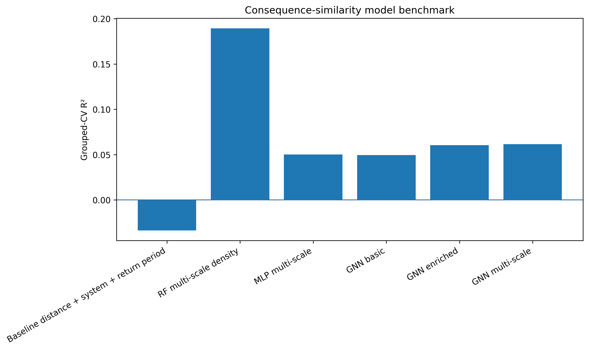
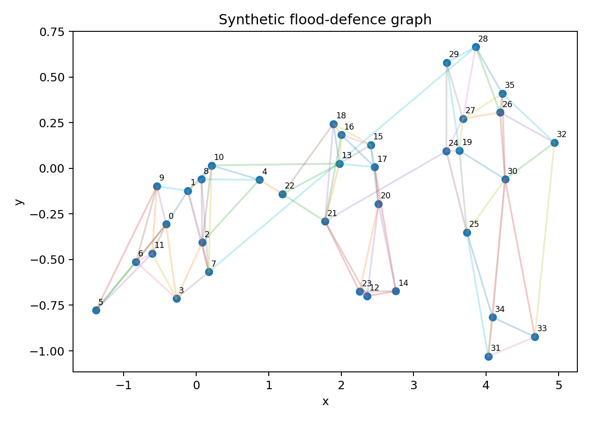
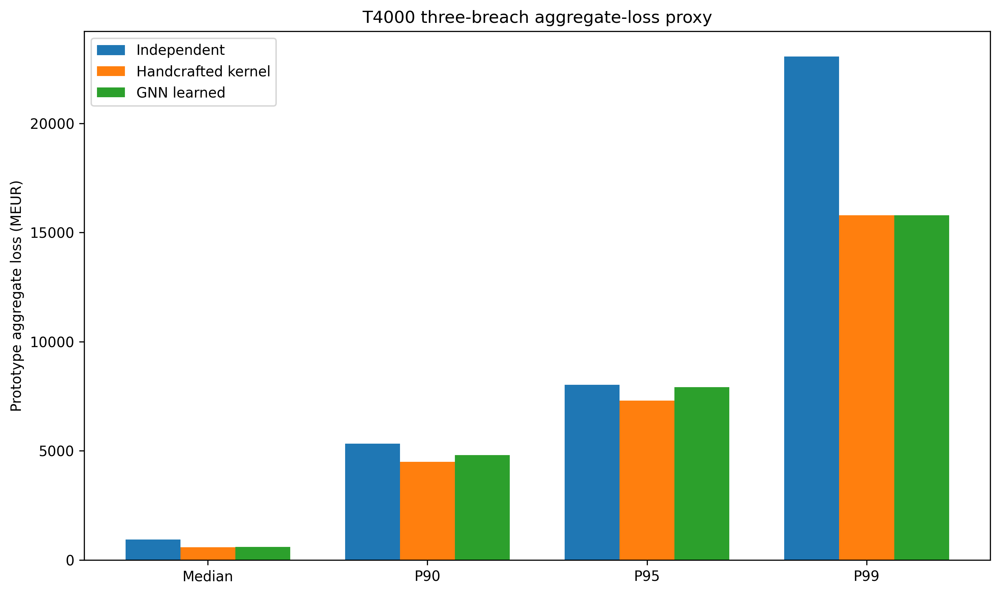

# BREACH-AI: Probabilistic Multi-Breach Flood Scenario Generation

A research prototype for learning spatial and system-level dependence between flood-defence breach locations and using that structure to generate synthetic multi-breach flood events for financial-risk analysis.

The project was developed around a practical question:

> **How can predominantly single-breach flood scenarios be extended into a richer set of spatially dependent multi-breach events without losing the structure of the underlying flood-defence system?**

The prototype combines geospatial analysis, machine learning, graph neural networks, probabilistic event generation, and an exploratory financial-loss layer.

---

## Research context

Existing hydraulic flood-scenario catalogues are valuable for describing the consequences of individual flood events, but financial risk assessment may require a broader probabilistic scenario space, including spatially dependent combinations of flood-defence failures.

This repository explores one possible AI-based framework for extending such scenario sets.

The project is related to the research direction of **Pillar 3 of the Flood Insurance and Risk Management (FIRM) programme at the University of Amsterdam**, which focuses on hybrid AI methods for extending flood scenarios, modelling impacts probabilistically, translating scenarios into future climate states, and supporting financial-sector applications such as damage assessment and long-term insurability analysis.

---

# What I investigated

The research developed progressively through the following questions:

1. **Is there measurable spatial and system-level structure in the LIWO flood-scenario data?**
2. **Can that structure help predict similarity in flood consequences?**
3. **Can the relationships be represented as a graph?**
4. **Can those relationships be converted into a probabilistic mechanism for generating multi-breach events?**
5. **What happens to simulated financial losses when breach dependence is introduced instead of assuming independence?**
6. **Where does a pairwise generation approach break down, and what would a higher-order model require?**

The repository documents these steps rather than presenting a single final model.

---

# Main findings

## 1. LIWO data reconstruction

The analysed LIWO inventory contained:

- **633** primary breach locations
- **1,856** scenario records
- **619** breach locations with scenario records
- **610** locations with usable numeric damage observations

The catalogue has heterogeneous scenario coverage across locations, so return-period-specific analyses were treated carefully rather than assuming a balanced panel.

---

## 2. Spatial and system structure

I first tested whether breach locations that are geographically or systemically related also tend to have more similar modelled consequences.

The analysis considered:

- geographic distance
- river membership
- dike-ring membership
- broader spatial neighbourhood structure

Distance alone was not sufficient to explain the observed variation, which motivated richer spatial and system-level representations.

---

## 3. Predictive modelling

I compared several modelling approaches for the consequence-similarity proxy:

| Model | MAE | R² |
|---|---:|---:|
| Random Forest — multi-scale density | **0.1877** | **0.1893** |
| MLP — multi-scale | 0.2150 | 0.0501 |
| GNN — multi-scale | 0.2150 | 0.0614 |

The **Random Forest was the strongest predictive benchmark** for the tested consequence-similarity target.

I therefore do not present the GNN as the best predictor.

Instead, the GNN was used for a different purpose: representing relationships between breach locations and constructing a learned dependence mechanism for synthetic event generation.



---

## 4. From prediction to probabilistic event generation

The main transition in the project was from predicting pairwise similarity to generating multi-breach events.

Three mechanisms were compared:

1. **Independent sampling**
2. **Handcrafted spatial/system dependence kernel**
3. **Learned GNN dependence**

For generated 3-breach events, the mean pairwise distance and system-level clustering changed substantially between the models.

| Generator | Mean pair distance (km) | Same-river pairs | Same-dike-ring pairs | Same-system pairs |
|---|---:|---:|---:|---:|
| Independent | 97.36 | 5.33% | 3.26% | 1.50% |
| Handcrafted kernel | 17.83 | 49.62% | 42.88% | 30.31% |
| GNN learned | 21.94 | 43.32% | 44.64% | 28.68% |

The GNN-generated events therefore showed substantially more spatial and system-level clustering than independent sampling.

Importantly, these are **properties of the synthetic event sets**, not empirical estimates of the probability of real simultaneous breach failures.



---

# A failed experiment that changed the direction

One of the most useful results was a failure rather than an improvement in a benchmark score.

The pairwise sequential generator worked reliably for small events, but completion deteriorated as event size increased:

| Event size | GNN completion |
|---:|---:|
| 2 breaches | 100.0% |
| 3 breaches | 88.3% |
| 4 breaches | 70.4% |
| 5 breaches | 51.3% |

This showed me that learning pairwise relationships was **not equivalent to learning a coherent higher-order joint distribution**.

That result motivated a different formulation in which the probability of the next breach depends on the **whole event history**, rather than only on the current breach.

The proposed higher-order architecture is documented in:

`07_Higher-Order_Probabilistic_Multi-Breach_Generation.ipynb`

The architecture is currently a research prototype / design and smoke test. It is **not presented as a trained higher-order flood model**.

---

# Financial-loss propagation

To examine why the dependence structure matters for the financial sector, I propagated generated multi-breach events into an exploratory aggregate-loss proxy.

For a controlled **T4000-conditioned 3-breach experiment**, the resulting loss distributions differed across:

- independent sampling
- handcrafted dependence
- learned GNN dependence

The key observation was not that dependence is universally risk-increasing or risk-reducing.

Rather:

> **Changing the assumed breach dependence changes the resulting loss distribution and its upper tail.**

That is relevant to applications where scenario sets are used to construct financial stress tests or portfolio loss distributions.



### Important limitation

The financial layer is an **aggregate-loss proxy** obtained from existing single-breach modelled damages.

It is therefore not a new hydraulic simulation of simultaneous failures, and it does not reproduce hydraulic interaction effects between multiple simultaneous breaches.

---

# Climate conditioning and insurability

Notebook 6 explores how the probabilistic scenario-generation framework could be connected to future climate states and insurability analysis.

The project direction considers future climate scenarios, including **KNMI'23 and IPCC-based states**, together with adaptation pathways and long-term insurability applications.

In this repository, climate conditioning is treated as a **research framework and extension point**, rather than claiming that arbitrary climate multipliers constitute validated hydraulic projections.

The intended downstream chain is:

```text
Current hydraulic scenarios
        ↓
Spatial / defence-system structure
        ↓
Probabilistic dependence learning
        ↓
Higher-order multi-breach generation
        ↓
Hydraulic consequence model
        ↓
Portfolio loss distribution
        ↓
Climate-state conditioning
        ↓
Insurability analysis
```

---

# Repository structure

```text
breach-ai-flood-scenarios/
│
├── notebooks/
│   ├── 01_breach_method_reconstruction.ipynb
│   ├── 02_spatial_dependence.ipynb
│   ├── 03_ml_spatial_prediction.ipynb
│   ├── 04_graph_model.ipynb
│   ├── 05_probabilistic_breach_dependence.ipynb
│   ├── 06_Climate-conditioned_scenario_extension_and_insurability_stress_testing.ipynb
│   ├── 07_Higher-Order_Probabilistic_Multi-Breach_Generation.ipynb
│   └── 08_Final_synthesis_and_reproducibility.ipynb
│
├── data/
│   ├── raw/
│   └── processed/
│
├── results/
│   ├── figures/
│   ├── logs/
│   ├── models/
│   ├── tables/
│   └── BREACH_AI_executive_summary.txt
│
└── README.md
```

---

# Notebook guide

### `01_breach_method_reconstruction.ipynb`

Reconstructs and audits the LIWO scenario inventory and establishes the working breach-location and scenario datasets.

### `02_spatial_dependence.ipynb`

Investigates spatial dependence and consequence similarity using distance, river, dike-ring, and other spatial/system relationships.

### `03_ml_spatial_prediction.ipynb`

Benchmarks tabular machine-learning models for predicting the consequence-similarity proxy.

### `04_graph_model.ipynb`

Builds the breach-location graph and evaluates graph-based representations using edge-aware GNN models.

### `05_probabilistic_breach_dependence.ipynb`

Develops the probabilistic dependence framework, including:

- independence baseline
- handcrafted spatial/system kernel
- learned GNN dependence
- synthetic multi-breach generation
- T4000-conditioned financial-loss propagation

### `06_Climate-conditioned_scenario_extension_and_insurability_stress_testing.ipynb`

Explores climate-state conditioning, generator coverage, financial stress testing, and limitations of extrapolating current scenario sets toward future states.

### `07_Higher-Order_Probabilistic_Multi-Breach_Generation.ipynb`

Introduces the proposed higher-order event-state architecture motivated by the failure of purely pairwise sequential generation for larger events.

### `08_Final_synthesis_and_reproducibility.ipynb`

Reproduces the main outputs and provides the final synthesis of the prototype, results, limitations, and proposed research extensions.

---

# Results and reproducibility

The `results/` directory contains the persisted outputs from the experiments.

```text
results/
├── figures/
│   ├── calibration_comparison.png
│   ├── intervention_sensitivity.png
│   ├── model_benchmark_r2.png
│   ├── synthetic_defence_graph.png
│   └── t4000_financial_tails.png
│
├── logs/
│
├── models/
│
├── tables/
│   ├── edge_gnn_5fold_results.csv
│   ├── generator_comparison_3breach.csv
│   ├── gnn_transition_probabilities.csv
│   ├── handcrafted_kernel_probabilities.csv
│   ├── higher_order_completion.csv
│   ├── master_model_comparison.csv
│   ├── model_comparison_5fold.csv
│   ├── model_comparison_summary.csv
│   ├── t4000_financial_comparison.csv
│   └── ...
│
└── BREACH_AI_executive_summary.txt
```

The final synthesis notebook provides the reproducibility trail linking:

**data reconstruction → dependence analysis → model comparison → event generation → financial-loss proxy → limitations → next research step.**

---

# Important methodological limitations

This repository is a **research prototype**, not a validated production flood-risk or insurance model.

The main limitations are:

### Limited simultaneous-breach observations

The LIWO catalogue analysed here does not contain sufficient simultaneous-breach observations for direct empirical estimation of joint breach probabilities.

### Consequence similarity is a proxy

The dependence experiments use similarity in modelled flood consequences as an observable proxy for relationships between breach locations.

### Single-breach damage propagation

The financial-loss calculations aggregate existing single-breach modelled damages. They do not simulate the hydraulic interaction of simultaneous breaches.

### Higher-order dependence remains unresolved

The pairwise sequential generator becomes increasingly incomplete as the number of breaches grows, motivating the higher-order event-state formulation.

### Heterogeneous return-period coverage

Different return periods cover different subsets of breach locations, so cross-return-period comparisons are interpreted as sensitivity analyses rather than a balanced panel.

### Synthetic probabilities are model outputs

The generated transition probabilities should not be interpreted as calibrated real-world probabilities of simultaneous breach failure.

---

# Research direction

The prototype suggests a future hybrid framework in which:

- AI learns useful spatial and system-level dependence;
- higher-order models represent multi-breach event structure;
- hydraulic models constrain and validate generated events;
- uncertainty is propagated through the scenario-generation process;
- future climate states are incorporated explicitly;
- hydraulic consequences feed into portfolio-level financial losses;
- scenario distributions can then support long-term insurability analysis.

---

# Status

**Research prototype / exploratory implementation**

This repository documents an evolving research investigation rather than a final validated model.

The strongest conclusions from the current experiments are:

1. spatial and system-level structure is present in the analysed flood-scenario data;
2. richer spatial context improves prediction of the tested consequence-similarity proxy;
3. the GNN can generate substantially more spatially/systemically clustered events than independent sampling;
4. pairwise sequential generation becomes increasingly incomplete for larger multi-breach events;
5. dependence assumptions materially change simulated aggregate-loss distributions;
6. a hybrid, higher-order AI–hydraulic framework is a natural next research step.

---

# Data

The repository contains `data/raw/` and `data/processed/` directories because the notebooks use a reproducible data-processing pipeline.

Before publishing the raw data, check that each source permits redistribution through GitHub. Where redistribution is restricted, keep the raw files outside the repository and provide instructions for obtaining them separately.

---

# Technical stack

The prototype uses Python-based scientific and machine-learning tooling, including:

- Python
- NumPy
- pandas
- GeoPandas
- scikit-learn
- PyTorch
- PyTorch Geometric
- NetworkX
- Matplotlib

---

# Author

**Anuj Pal**

Research prototype developed for exploring AI-driven probabilistic flood scenario generation and financial-risk applications.
